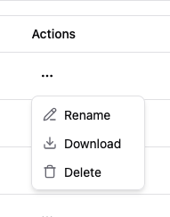

# Harvey AI Takehome - Bit Complete

# Table of Contents

1. [Setup](#setup)
2. [Technical Decisions](#technical-decisions)
3. [UX](#ux)

## Setup <a name="setup"></a>

In the root directory

```
nvm use
```

You should now be using node v24.7.0

### Backend

```
cd backend
npm i
npm run dev
```

### Frontend

```
cd frontend
npm i
npm run dev
```

### Notes

The backend database is completely in the server's memory so if you restart the server, the database will be wiped. The PDFs blobs are stored in the browser using the IndexedDB API. So if the backend server is restarted, you will not run into any id conflicts if you reupload the same PDF after restarting.

## Technical Decisions <a name="technical-decisions"></a>

### Tech Stack

- Opted to use React Router with Data mode (https://reactrouter.com/start/modes#data)
  - Allows for easily keeeping the UI in sync after updates thanks to `loader` and `action`. (https://reactrouter.com/start/data/actions)
- Shadcn for the components to stay consistent with the already existing UI Harvey AI has and to improve speed of development by not having to build components manually.
- Tailwind since shadcn already uses it, so it's much easier to modify any shadcn components with custom CSS
- Typescript should be a given in my React application to ensure props don't accidentally get mutated and to allow for more readable code in general.

### Architecture

- Didn't make a dialog component since each once was quite different from each other (i.e the forms in `UploadFileDialogForm` and `DeleteDialogForm` aren't similar). By trying to abstract all these varying dialogs into one component, it's very easy to end up with a component that takes in way too many props and then it's rendering logic also could becomes very convoluted.
- In `main.tsx`, I kept everything under one path since all of the actions in the UI didn't require their own separate pages and are in modals. In order to be able to use React Router's `action` with this design, I opted to have each form submit an `actionType` field in their form which is used in `main.tsx` to call their respective action in `frontend/src/actions`. Doing this also gets the added bonus of `folderViewerLoader` being called automatically after any `action` is triggered.
- Didn't put the dialogs into `frontend/components` since components shouldn't have any business logic in them. Both `BreadCrumb.tsx` and `Sidebar.tsx` don't make any calls to the BE or any have relatively complicated logic. Compared to how almost every dialog components has a form in it.
- BE is just a simple express server which stores everything in-memory. This was to reduce scope with not having to deal with an actual database.

## UX <a name="ux"></a>

- To reduce scope, mobile view was **not** implemeneted.

#### Uploading Files


### Creating New Folder

- Put a max character size limit of 255. This is also what Google Drive does.
- Added a character counter so users can know character size limit before hitting it.


### Data Viewer

- If a folder/file name is really long, it's truncated to 100 characters. A hover card will appear if a user hovers over a folder/file name to see the full name in all cases.


- The table also supports sorting by name and kind.


### Actions

- The actions for a file and folder are different. (Download button is just a dummy and doesn't do anything.)




### Renaming

- The rename dialog auto fills with the folder/files current name and has the input also focused for convenience.
- Also has a character counter and character size limit.


### Deleting

- A confirmation dialog is added to ensure users don't accidentally delete files. But a better feature would be to make it so "deleted" files are put in the trash for 30 days before being permanently deleted.
- The CTA button in this dialog is a very aggressive red to also help prevent accidental deletion.


### Nested Folder Navigation

- Users can select on a row in the table for a folder and navigate inside of it. The pointer cursor helps indicate this.

### Create Folder

- There's text in this dialog to make it very clear to users where this folder is being created. Opted to have folders created in whatever folder the user is currently in since users are more likely to be thinking about organization where they currently are in their workspace.


### PDF Viewer


